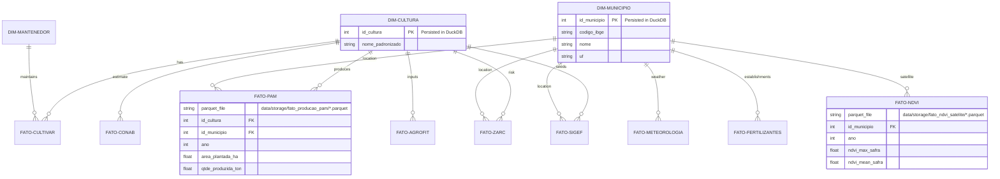
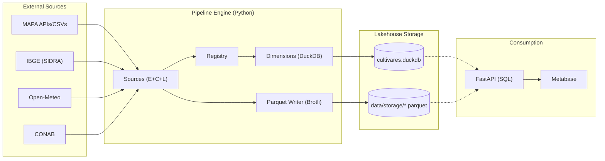

# AgroHarvest BR - Lakehouse Architecture and Modeling

This document details the data structure and information flow of the AgroHarvest BR project, now operating under the **Data Lakehouse** paradigm.

## 1. Data Model (Star Schema)

Although physical storage is implemented with **Apache Parquet** files, the logical model follows a **Star Schema**. DuckDB acts as the engine that provides a SQL interface over those files, guaranteeing referential integrity in dimensions and analytical performance over facts.

## 2. Data Flow (Lakehouse Engine)

The pipeline uses the **Registry Pattern** for ingestion and **DuckDB** for the service layer. Data is extracted, cleaned, and saved in columnar format (Parquet) with **Brotli** compression, optimizing I/O and storage cost.

## 3. Benefits of the Current Architecture

1.  **Columnar Storage:** Facts with millions of rows are stored in Parquet, allowing DuckDB to read only the columns required for each query and drastically reduce memory usage.
2.  **Zero-Latency Service:** Because DuckDB runs inside the same process as the API, there is no network latency between the application server and the database.
3.  **Portability (Cloud Native):** The `data/storage` repository can be mounted as a volume in any cloud (OCI, AWS, Azure) without expensive managed database services.
4.  **Horizontal Read Scalability:** Multiple API instances can efficiently read the same Parquet files simultaneously.

---
*Documentation updated for the AgroHarvest BR Lakehouse modernization phase.*
