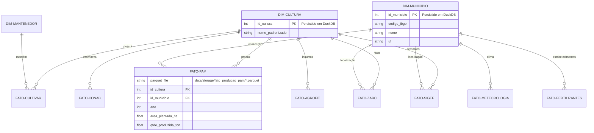

# AgroHarvest BR - Arquitetura e Modelagem Lakehouse

Este documento detalha a estrutura de dados e o fluxo de informações do projeto AgroHarvest BR, agora operando sob o paradigma de **Data Lakehouse**.

## 1. Modelo de Dados (Star Schema)

Embora o armazenamento físico seja feito em arquivos **Apache Parquet**, o modelo lógico segue um **Star Schema (Esquema Estrela)**. O DuckDB atua como o motor que provê uma interface SQL sobre esses arquivos, garantindo integridade referencial nas dimensões e performance analítica nos fatos.

## 2. Fluxo de Dados (Lakehouse Engine)

O pipeline utiliza o **Registry Pattern** para ingestão e o **DuckDB** para a camada de serviço. Os dados são extraídos, limpos e salvos em formato colunar (Parquet) com compressão **Brotli**, otimizando o I/O e o custo de storage.

## 3. Benefícios da Arquitetura Atual

1.  **Storage Colunar:** Os fatos (milhões de linhas) são armazenados em Parquet, permitindo que o DuckDB leia apenas as colunas necessárias para cada query, reduzindo drasticamente o uso de memória.
2.  **Zero-Latency Service:** Como o DuckDB roda dentro do mesmo processo da API, não há latência de rede entre o servidor de aplicação e o banco de dados.
3.  **Portabilidade (Cloud Native):** O repositório `data/storage` pode ser montado como um volume em qualquer nuvem (OCI, AWS, Azure) sem necessidade de serviços de banco de dados gerenciados caros.
4.  **Escalabilidade Horizontal de Leitura:** Várias instâncias da API podem ler os mesmos arquivos Parquet simultaneamente de forma eficiente.

---
*Documentação atualizada para a fase de Modernização Lakehouse do AgroHarvest BR.*
